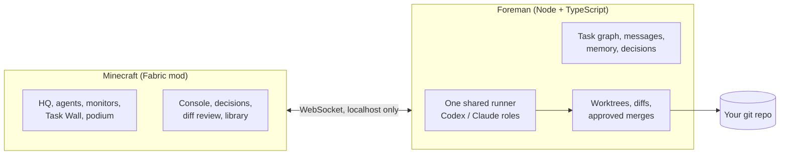

<div align="center">

# AgentCraft

**A team of coding agents doing real work on your code, inside a Minecraft studio you can walk around in.

This fork adds a local Codex backend, mixed Codex/Claude teams and authenticated dedicated-server multiplayer. Single-harness teams and single-player workflows remain available.**

*Powered by local Codex and Claude Code*

[](LICENSE)
[](https://www.minecraft.net)
[](https://fabricmc.net)
[](https://code.claude.com/docs/en/agent-sdk/overview)
[](docs/contribution-handoff.md)


</div>

<br>

Multi-agent coding usually means a wall of terminal text. AgentCraft turns it into a place.

You submit `/goal <text>`. A lead agent reads your repo, writes a plan and pins tasks to a wall. Workers walk to
their desks, sit down and start coding in their own git worktrees while their monitors stream every
file they read and every line they change. When a call is genuinely yours, an agent walks over to
you with a question. When work is ready, you review the real diff and press **Merge**. Nothing
touches your branch without that click, and nothing is ever pushed.

Close the game and the agents keep working. Open it again and the studio catches up.

<br>

## How a goal plays out

<table>
<tr>
<td width="50%" valign="top">

**1. You give a goal.** Press <kbd>`</kbd> and type `/goal Add OAuth to life-tracker`. Plain text talks to Marlow and can steer an active goal. `@juniper` messages a specific agent, with
Tab completion.


</td>
<td width="50%" valign="top">

**2. The lead plans.** Marlow splits the goal into tasks with dependencies. They land on the Task
Wall, and the plan goes into the shared library.


</td>
</tr>
<tr>
<td width="50%" valign="top">

**3. The team builds.** Each worker codes in its own worktree. Monitors stream the live log: tool
calls, test runs, red and green diffs.


</td>
<td width="50%" valign="top">

**4. They come to you.** A clay <kbd>!</kbd> appears, the bell rings, the agent walks to the
podium. Press <kbd>J</kbd> to answer.


</td>
</tr>
<tr>
<td width="50%" valign="top">

**5. You review and merge.** A real code review screen: file list, line numbers, collapsed context,
the worker's summary and the reviewer's notes.


</td>
<td width="50%" valign="top">

**6. Memory stays shared.** The lead's plan, decisions and repo conventions live in a library every
agent reads, and you can too.


</td>
</tr>
</table>

<br>

## Meet the team


Six hand-pixelled characters, each with their own silhouette and colour. **Marlow** leads: he plans,
splits work and reviews. **Juniper, Kit, Wren, Rowan and Tove** build. They walk the studio with
real pathfinding, sit at their desks while they type, show what they are doing with small particles
and nameplates, talk in speech bubbles, and come find you when they need a decision.

<br>

## The studio

<table>
<tr>
<td width="50%"></td>
<td width="50%"></td>
</tr>
<tr>
<td><b>The Goal Atrium.</b> Progress ring, task counts, and how many decisions need you.</td>
<td><b>The studio floor.</b> Desks, status lamps, the library and the lounge.</td>
</tr>
</table>


Everything is information you can read at a glance. Far away, the lamps and the cupola beacon tell
you who is working, who is stuck and who is waiting on you. Closer, nameplates and cards tell you
what. Up close, monitors and screens tell you exactly how.

<br>

## Proven with real agents

This is not a mockup. These screenshots come from a real run with Claude agents on a sample repo,
driven entirely through the game: a goal typed into the console, questions and permission prompts
answered in game, merges reviewed in the diff screen, including a merge conflict sent back to the
worker and resolved. The game was restarted mid run and the Foreman was taken offline and brought
back. Six features landed in the repo with its tests passing.

<table>
<tr>
<td width="33%"></td>
<td width="33%"></td>
<td width="33%"></td>
</tr>
<tr>
<td>Marlow asks which default export format to use.</td>
<td>A worker's monitor streaming its live log.</td>
<td>Back online after a Foreman restart, the team resumes.</td>
</tr>
</table>

<br>

## Safe on real repos

AgentCraft is built to point at code you care about.

- **Worktrees, always.** Every task runs in its own git worktree on `agentcraft/<agent>/<task>`. Your
  checkout is never touched by an agent.
- **You merge, nobody else.** A merge happens only when you approve it. It is refused if your
  checkout has uncommitted changes. Conflicts go back to the worker, who resolves them and asks again.
- **Nothing is ever pushed.** Agents get no git network access at all. This is enforced inside git
  itself, not just by a command filter, so even a push hidden in a test script or a hook fails.
- **Risky commands ask first.** Reads and edits inside the worktree are allowed. Anything else
  (writing outside it, network access, destructive commands) becomes an in game permission prompt
  that shows exactly what "Always allow" would cover.
- **Clear authorship.** Agents commit as `AgentCraft <Name>`. Only the merge you approve is made as you.

<br>

## Quick start

**You need:** Windows 10 or 11, or macOS, Java 25, Node 22+, git, and a copy of
Minecraft: Java Edition.

**For Codex agents**, install the Codex CLI and sign in locally with `codex login`.
Check it with `codex login status`, then use `--backend codex` (macOS) or
`-Backend codex` (Windows). See [Codex and multiplayer](#codex-and-dedicated-server-multiplayer).

**For Claude agents** you need Claude API access, either of these:

- `ANTHROPIC_API_KEY`: create a key at [console.anthropic.com](https://console.anthropic.com), then
  `setx ANTHROPIC_API_KEY sk-ant-...` and open a new terminal.
- A cloud provider supported by the Agent SDK: Amazon Bedrock (`CLAUDE_CODE_USE_BEDROCK=1`), Google
  Vertex AI (`CLAUDE_CODE_USE_VERTEX=1`) or Microsoft Foundry (`CLAUDE_CODE_USE_FOUNDRY=1`), with that
  provider's usual credentials.

Then:

```powershell
git clone https://github.com/blendi-remade/agentcraft
cd agentcraft

tools\launch.ps1 -Backend sim                    # try it first: a simulated team, no API usage
tools\launch.ps1 -Repo C:\path\to\your\repo      # real agents on your repo
tools\stop.ps1                                   # stop everything launch.ps1 started
```

On macOS, install Java 25 with `brew install openjdk@25`, then run from the checkout
(the script selects that JDK without changing your system Java):

```sh
node tools/mac.mjs launch --backend sim                 # try the studio without API usage
node tools/mac.mjs stop --profile sim
node tools/mac.mjs launch --repo /path/to/your/repo --use-claude-login
node tools/mac.mjs stop
```

The macOS launcher installs npm dependencies on first run, downloads Minecraft and Fabric
through Gradle, starts the Foreman and game in the background, and waits for the studio world.
Use `--dev` for a muted client that does not take focus; `--no-game` starts only the Foreman.
See [tools/README.md](tools/README.md) for options and logs.

The first launch installs npm dependencies and lets Gradle download Minecraft and Fabric, which
takes a few minutes. After that, a launch reaches the studio in under a minute. The HQ builds itself
the first time; in an older world, rebuild it with `/agentcraft hq`.

> **Personal use with Claude Code.** If you already use Claude Code, `tools\launch.ps1 -UseClaudeLogin`
> runs the agents on your own `claude` CLI login instead of an API key. Anthropic does not allow
> third party tools to offer claude.ai login to their users, so this is off by default and meant for
> running AgentCraft yourself. To make it permanent for yourself, put
> `{"claude": {"useClaudeLogin": true}}` in `~/.agentcraft/config.json`.

**Your name.** The agents call you by your OS user name. Change it with
`-ForemanArgs '--user-name','Sam'`, `AGENTCRAFT_USER_NAME`, or `{"userName": "Sam"}` in
`~/.agentcraft/config.json`.

<br>

## Controls

| Key | What it does |
|---|---|
| <kbd>`</kbd> | Open the **console** |
| <kbd>J</kbd> | **Answer decisions**: questions, permission prompts and merges, oldest first |
| <kbd>Enter</kbd> on a terminal block | Open the console |
| Right click an agent | Agent card: state, task, recent log, message, pause, stop |
| Right click the podium, merge station, archive or a task card | Decisions, diff review, memory library, task details |

All keys can be rebound in Options, Controls.

**Console commands.** Plain text talks to Marlow. `/goal <text>` explicitly starts work; with several repositories, choose the target before submitting. `@name message` and `@all message` keep their existing routing. Messages can also steer an active goal.

| Command | |
|---|---|
| `/goal <text>` | Start a new goal for Marlow |
| `/answer [d4] <n or option> [text]` | Answer an open decision |
| `/diff [worktree or @agent]` | Review a worktree's changes |
| `/status` | Goal, agents, tasks, decisions and spend |
| `/pause @x`, `/resume @x` | Pause an agent, keeping its task |
| `/stop @x`, `/spawn @x [task]` | Take an agent off shift, or bring one on |
| `/repo add <path>`, `/repos` | Register and list repos |
| `/help` | Everything else |

<br>

## How it works



- **The Foreman** (`foreman/`) runs the agents and owns all the state: tasks and their
  dependencies, messages, shared memory, decisions and worktrees. Everything is saved to disk and
  Provider sessions are saved separately and interrupted jobs retain their provider and job kind on restart.
- **The mod** (`mod/`) is the window and the controls. It draws what the Foreman knows and sends
  back what you decide. If the game closes, no work is lost.
- **The sim backend** is a scripted team that exercises every feature with real git edits. It powers
  the demo, the screenshot QA and development, without any API usage.

<details>
<summary><b>More on the Foreman</b></summary>

<br>

- **Team:** a lead (Opus by default) that plans and reviews, and up to three workers at once (Sonnet
  by default). Pick the team with `--workers`.
- **Task graph:** tasks only start when the tasks they depend on are done, and move through todo,
  doing, review and done, with blocked on the side.
- **CI loop:** your tests run after each task. A failure goes back to the worker once, then to review
  with the failure noted.
- **Merge conflicts:** when parallel work collides, the branch goes back to its worker, who merges
  your branch in, resolves it and sends a fresh review.
- **Messages:** agents message each other and you, and a message to a busy agent reaches it mid task.
- **Spend:** a running total in `/status` and the console header.
- **Protocol:** documented in [docs/protocol.md](docs/protocol.md), generated from the schemas and
  kept in sync by `npm run check`.

</details>

<br>

## Costs

The claude backend bills per token to your Anthropic or cloud provider account. A small goal costs a
few dollars. For a cheaper team:

```powershell
tools\launch.ps1 -Repo C:\path\to\repo -ForemanArgs '--model','sonnet','--effort','low','--workers','juniper,kit'
```

Measured with those settings on the sample repo: three two task goals, including two merge conflicts
the workers resolved, took 2 to 10 minutes each and about $6 in total. The sim backend is free.

<br>

## Project layout

| Path | What lives there |
|---|---|
| [`foreman/`](foreman) | The orchestrator: agents, task graph, memory, decisions, git safety and tests |
| [`mod/`](mod) | The Fabric mod: HQ builder, agents, displays, screens, HUD |
| [`assets-src/`](assets-src) | Scripts that generate every skin, block texture and UI sprite |
| [`tools/`](tools) | Launcher, stop script, DevBridge CLI, screenshot and QA runner |
| [`docs/`](docs) | Protocol reference, QA guide, design notes |

<br>

## Development

```powershell
cd foreman; npm run check                 # typecheck, tests, protocol docs
cd mod; .\gradlew.bat build                # the mod
node tools/qa.mjs --home .agentcraft-home  # capture the 10 shot QA gallery
```

Every visual in this README was captured in game through the **DevBridge**, a small localhost API in
the mod that scripts use to move the camera and take screenshots. Start with
[mod/DEV.md](mod/DEV.md) and [mod/FEATURES.md](mod/FEATURES.md) for the mod,
[foreman/README.md](foreman/README.md) for the orchestrator and [docs/QA.md](docs/QA.md) for the
screenshot suite.

<br>

## Status

AgentCraft is young and has been used by one person on one machine. Today it is:

- **Windows and macOS development launchers.** Both platforms have desktop notifications when
  the agents need a decision. macOS has been tested on Apple Silicon; Intel Macs are not yet tested.
- **Singleplayer and dedicated multiplayer** on **Minecraft 26.3**, with one shared studio and an owner-authorized Foreman.
- **Development client or normal Fabric launchers.** This fork includes a standalone mod jar and a Prism import package.

Issues and ideas are welcome.

<br>

## License

[MIT](LICENSE). All art (skins, block textures and UI sprites) is generated by the scripts in
`assets-src/` and is covered by the same license. Minecraft is not included: Gradle downloads it from
Mojang for development, and players need their own copy of Minecraft: Java Edition. AgentCraft is
not affiliated with Mojang, Microsoft or Anthropic.

<div align="center">
<br>
<sub>Built with Claude.</sub>
</div>


## Team harness, model and reasoning setup

Launch with `--backend codex` to use Codex as the initial harness. Install and authenticate the
provider CLIs on the Foreman host (Claude can also use its SDK bundled executable). Claude API authentication remains the default; `--use-claude-login` explicitly selects a personal subscription login. On the first unconfigured
owner connection, **Team setup** detects their availability and model catalogs. Choose **All
Codex**, **All Claude**, or **Mixed team**, then **Choose…** for each lead, worker and reviewer
role to select its provider, model and supported reasoning level. Catalogs depend on your local
CLI and account; the gallery's model names are examples.

Presets and role-picker selections are drafts until **Save team** validates all three roles.
Current turns continue; saved choices apply to new turns. Individual agent overrides are kept
unless you explicitly select their reset. An agent card's **Model** screen lets you preview
Codex/Claude, apply a per-agent choice or restore **Role defaults**, and reopen **Team setup**.
Unavailable providers show an error rather than silently switching harnesses.

One Foreman and shared runner schedule both providers, run CI and open permission/merge decisions
for the owner. A Claude reviewer does not start a second scheduler or approve its own merge.
See [setup instructions and qualification limits](docs/qa/team-setup.md) and the
[annotated setup gallery](docs/contribution-gallery.html).

## Codex and dedicated-server multiplayer

Use the signed-in local Codex CLI with `--backend codex`; no OpenAI API
key is copied into Minecraft. The Foreman runs Codex sessions on the host,
streams their activity into the studio, and keeps the existing worktree,
permission, review, and owner-approved merge workflow.

```sh
node tools/mac.mjs launch --backend codex --repo /path/to/authorized/repo --no-game
```

Install AgentCraft, Fabric API, and Polymer 0.18.2+26.3 on the dedicated
server and on the coding player's Fabric client. Guests can join with plain
Minecraft Java 26.3. Polymer projects custom studio blocks and items into
vanilla equivalents for guests; studio clients retain the real custom models
and displays. Each studio client reaches Foreman through Minecraft's
authenticated connection. The Foreman WebSocket stays on host loopback.
Set the server's `agentcraft.owner.uuid` property to the owner's Minecraft
UUID; ordinary clients do not need the owner's Codex login or a Foreman URL.
Only the configured owner directs coding work and approves permissions or
merges. Other players can see the shared studio and submit owner-visible
requests. Dedicated offline-mode ownership is disabled by default; the
`agentcraft.owner.allowOffline=true` override is for isolated local tests.

On a survival world, `/agentcraft hq studio at X Y Z` builds at the chosen
location without changing the world's spawn or gamerules. `/agentcraft visit`
goes to the published studio. Native `AgentCraft HQ` worlds keep the original
creative studio setup. Type `@codex your message` in ordinary Minecraft chat,
use `/agentcraft ask your message`, or open the in-game console.

`tools/package_multiplayer.py` creates a Prism client ZIP and standalone jar.
`tools/install_server.py` is a macOS helper for a specific existing managed Fabric
server `control.py`, not a general server installer. It checks mod IDs, backs up
replaced files, and writes host-specific Codex startup configuration without
restarting the server. Local server state, world files and credentials are
excluded from the client ZIP. See [packaging and setup](tools/README.md#multiplayer-packaging-and-managed-server-setup)
for prerequisites and rollback, and the [contribution handoff](docs/contribution-handoff.md)
for the complete checkpoint inventory, draft PR and qualification limits.
